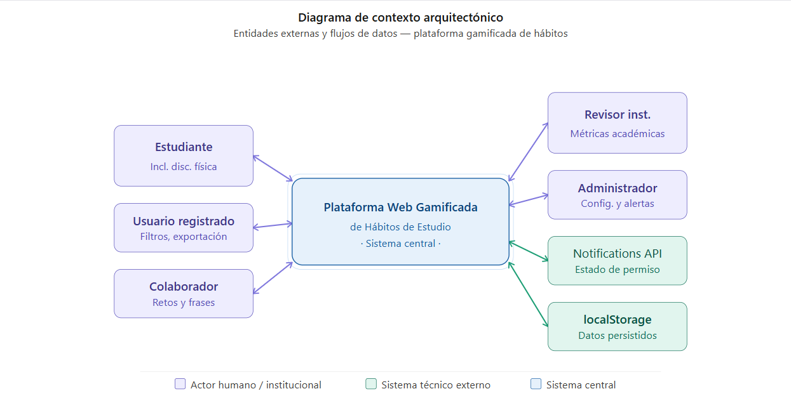

## Diagrama de Contexto Arquitectónico (DCA)

### Descripción textual del DCA

El sistema central se denomina Plataforma Web Gamificada de Hábitos de Estudio. Actúa como núcleo que procesa, almacena (SQLite vía Node.js/Express) y responde a todas las interacciones del sistema.

**Entidades y flujos:**

- **Estudiante / Persona con discapacidad física** → envía registro, tareas, sesiones, filtros y solicitudes de exportación → recibe puntos, insignias, estadísticas del Tablero de Avance Personal, panel de progreso filtrado y mensajes motivacionales. "Usuario registrado" es un estado de este mismo actor, no una entidad aparte.
- **Revisor institucional** → solicita estadísticas → recibe métricas de avance académico calculadas en tiempo real.
- **Administrador** → configura cuentas y catálogos de gamificación → recibe alertas y métricas globales.
- **Notifications API** → entrega estado de permiso → recibe instrucciones de disparar alertas.

> **Corrección de alcance (agosto 2026):** se retiraron `Colaborador` (sin sustento de autenticación ni caso de uso) y `localStorage` (la persistencia vigente es SQLite mediante el servidor Node.js/Express, un componente interno). Ver `M1_entidades_externas.md` y `E1-tabla-contexto.md`.

### Diagrama

**Archivo editable (Draw.io):** `E3-diagrama-contexto-DCA.drawio` (misma carpeta) — versión corregida, sin `Colaborador` ni `localStorage`.

