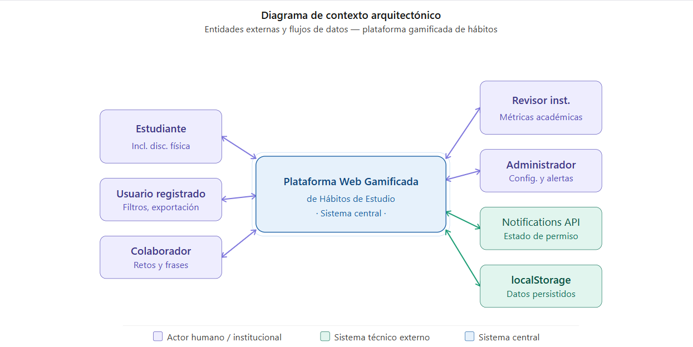

 Diagrama de Contexto Arquitectónico (DCA)

Descripción textual del DCA
El sistema central se denomina Plataforma Web Gamificada de Hábitos de Estudio. Actúa como núcleo que procesa, almacena y responde a todas las interacciones del sistema.
Entidades y flujos
•	Estudiante / Persona con discapacidad física → envía registro, tareas y sesiones → recibe puntos, insignias, reportes y mensajes motivacionales.
•	Usuario registrado → envía filtros y solicitudes de exportación → recibe datos filtrados y panel de progreso.
•	Colaborador → envía retos y frases → recibe estadísticas de uso.
•	Revisor institucional → solicita reportes → recibe métricas de avance académico.
•	Administrador → configura usuarios y gamificación → recibe alertas y métricas globales.
•	Notifications API → entrega estado de permiso → recibe instrucciones de disparar alertas.
•	localStorage → entrega datos persistidos → recibe instrucciones de guardar y exportar JSON.

## Diagrama de Contexto Arquitectónico

