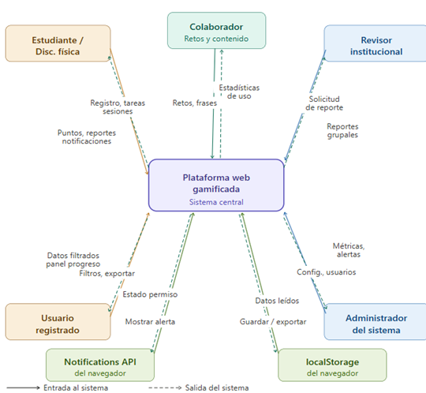

## Diagrama de Arquetipos

Clasificación de las 13 clases de dominio por categoría: Actor/Identidad, Gestión académica, Gamificación, Seguimiento y configuración.

**Archivo editable (Draw.io):** `E4-diagrama-arquetipos.drawio` (misma carpeta).

> **Hallazgo de auditoría (checklist DISEÑO, ítem 4 — resuelto):** la imagen `diagramaArc.png` no era un diagrama de arquetipos — era una copia del diagrama de contexto arquitectónico (actores alrededor del sistema central), con `Colaborador` y `localStorage` ya retirados del alcance. El contenido que sí correspondía a un diagrama de arquetipos vivía, por error, archivado como "Diagrama de Componentes" (`componentes.png`, ver `E5`). Ya se corrigió: el `.drawio` vigente clasifica las 13 clases del dominio (incluye `NivelCuenta`, `Notificacion` y `CuentaInsignia`, agregadas después de la imagen original; ya no incluye `Reporte`, eliminada).

