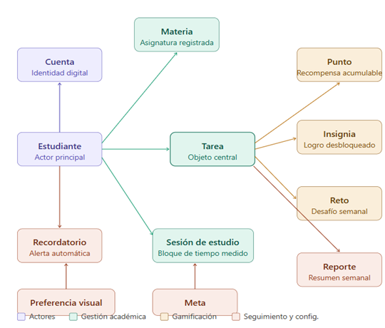

## Diagrama de Componentes (UML)

Módulos de software del sistema, agrupados por responsabilidad: Identidad y configuración, Gestión académica, Gamificación, Infraestructura.

**Archivo editable (Draw.io):** `E5-diagrama-componentes-UML.drawio` (misma carpeta).

> **Hallazgo de auditoría (checklist DISEÑO, ítems 4 y 11 — resuelto):** la imagen `componentes.png` clasificaba clases de dominio por categoría — eso era contenido de un diagrama de **arquetipos**, no de componentes UML (módulos de software con interfaces). El contenido que sí era un diagrama de componentes real vivía archivado, por error, como "Diagrama de Despliegue" (`Despliegue.png`, ver `E6`). Ya se corrigió: el `.drawio` vigente muestra los módulos de software reales (Autenticación, Tareas, Pomodoro, Agenda, Recompensas, Retos, Notificaciones, Almacenamiento), sin el componente «Reportes» que ya no existe.
>
> Este diagrama cumple la función de agrupación lógica de módulos que pide el checklist (ítem 11, "Diagrama de Paquetes"); no se duplica bajo otro nombre.

