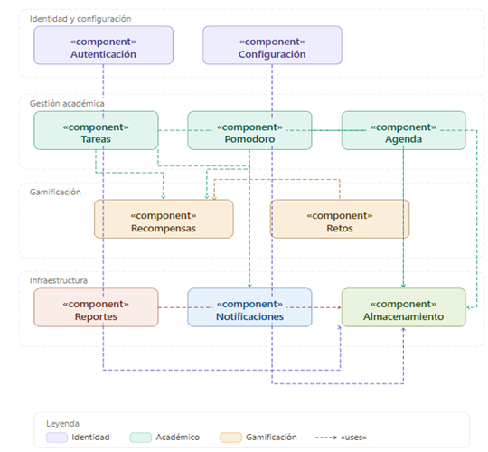

## Diagrama de Despliegue (UML)

Nodos físicos/lógicos donde se ejecuta el sistema: Navegador (cliente), Servidor de aplicación (Node.js/Express) y Motor de base de datos (SQLite), con los protocolos de comunicación entre ellos.

**Archivo editable (Draw.io):** `E6-diagrama-despliegue-UML.drawio` (misma carpeta).

> **Hallazgo de auditoría (checklist DISEÑO, ítem 4 — resuelto):** la imagen `Despliegue.png` mostraba bloques «component» de software, no nodos de despliegue — ese era el contenido real de un diagrama de **componentes** (ver `E5`). No existía ningún diagrama de despliegue real en el proyecto. Se construyó uno nuevo con los 3 nodos reales (Navegador, Servidor Node.js/Express, SQLite) y el protocolo HTTP/REST entre ellos.
>
> **Nota de estado del código:** al momento de esta revisión, `/src` solo contiene los modelos Sequelize y las funciones CRUD — no hay servidor Express, rutas ni `app.listen()` implementados todavía. Este diagrama documenta la arquitectura **objetivo** descrita en la ERS (`12-especificacion-requisitos-software.md`), no el estado actual del código. Esa brecha debe cerrarse en la fase de Construcción.

